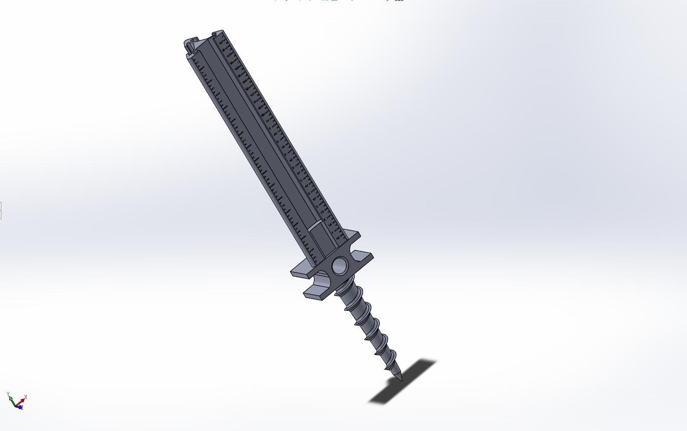

# TideMark™

### Open-source formwork elevation reference stake system

TideMark is a 3D-printable field tool that helps contractors set formwork to the correct elevation — without a surveyor on site. It's a triangular graduated tower that threads onto a printed ground stake, with an eye bolt for stringline attachment and a sliding lock screw for setting target elevation.

Designed by [Oasis Engineering, LLC](https://oasisengineering.com) — a structural engineering firm specializing in wind load analysis, residential permwork, and pre-construction elevation services.



## Build What the Site Actually Needs
In construction and engineering, teams often deliver the medium instead of the outcome.

The medium is familiar: a plan sheet, a note, or an elevation certificate. Those documents matter, but they are not the end goal.

The real goal is simple: the people in the field need to know the exact elevation of grade, formwork, or finished floor so they can build safely, accurately, and confidently — without second-guessing.

TideMark is designed around that reality. It takes the engineer's elevation intent and turns it into a physical, on-site reference that crews can act on immediately. Traditional exhibits and certificates still have their place; TideMark reduces the friction between "information delivered" and "work built correctly."

## The Problem

Contractors building slabs, accessory structures, and ADUs near flood zones need to hit a specific Finished Floor Elevation (FFE). Today, the typical workflow is:

1. Engineer specifies FFE on plans (e.g., "621.25' NAVD88")
2. Contractor stares at the number
3. Contractor eyeballs it with a tape measure off... something
4. Forms get set wrong
5. Everyone has a bad day

There is no affordable, standardized field tool that bridges the gap between a PE's elevation determination and the contractor's formwork.

**TideMark fixes that.**

## The System

TideMark is not just a stake — it's a field reference system with three components:

| Component | What It Does | Where It Lives |
|-----------|-------------|----------------|
| **TideMark Stake** | Physical elevation reference tool | This repo (open source) |
| **Formwork Elevation Reference Exhibit (FERE)** | PE-stamped elevation determination document | [Service from Oasis Engineering](https://oasisengineering.com) |
| **Field Methodology Guide** | Step-by-step photo-documented workflow | [`/docs/field-guide.md`](docs/field-guide.md) |

The stake is the delivery mechanism. The exhibit is the product. The methodology ties them together.

## How It Works

```
┌─────────────────────────────────────────────────────┐
│               ENGINEER SITE VISIT                    │
│                                                      │
│  1. PE performs differential elevation survey at      │
│     project site, establishes reference elevations   │
│                                                      │
│  2. PE drives TideMark ground stakes at strategic    │
│     benchmark locations around proposed structure    │
│                                                      │
│  3. PE threads tower onto each stake, sets lock      │
│     screw to required FFE offset, labels elevation   │
│                                                      │
│  4. PE photographs each installed TideMark stake     │
│     and surrounding site conditions                  │
│                                                      │
│  5. PE produces Formwork Elevation Reference Exhibit  │
│     with benchmark data, photos, and offset dims     │
│                                                      │
│  6. PE delivers exhibit to client — TideMark stakes  │
│     remain installed on site, ready for use          │
└──────────────────────┬──────────────────────────────┘
                       │
                       ▼
┌─────────────────────────────────────────────────────┐
│               CONTRACTOR EXECUTION                   │
│                                                      │
│  7. Contractor locates installed TideMark stakes     │
│     using exhibit site plan and photo references     │
│                                                      │
│  8. Contractor confirms stakes are undisturbed       │
│                                                      │
│  9. Contractor ties stringline to eye bolts —        │
│     the stakes are already set to FFE               │
│                                                      │
│  10. Contractor sets forms to stringline             │
│                                                      │
│  11. Contractor photographs stakes + forms and       │
│      sends to PE for pre-pour verification           │
└─────────────────────────────────────────────────────┘
```

## Repository Structure

```
tidemark/
├── README.md                    # You are here
├── LICENSE                      # MIT License
│
├── hardware/
│   ├── stl/                     # Print-ready STL files
│   │   ├── tidemark-tower-v1.stl
│   │   ├── tidemark-lockscrew-v1.stl
│   │   └── tidemark-groundstake-v1.stl
│   ├── source/                  # Editable CAD source files
│   │   ├── tidemark-tower-v1.step
│   │   ├── tidemark-lockscrew-v1.step
│   │   └── tidemark-groundstake-v1.step
│   ├── BOM.md                   # Bill of materials
│   └── PRINT-SETTINGS.md        # Recommended slicer settings
│
├── docs/
│   ├── field-guide.md           # Step-by-step field usage
│   ├── photo-verification.md    # How to photograph for documentation
│   ├── elevation-basics.md      # FFE, BFE, NAVD88 primer for contractors
│   └── faq.md                   # Common questions
│
├── exhibit/
│   ├── EXHIBIT-SPEC.md          # What goes into a Formwork Elevation
│   │                            #   Reference Exhibit (FERE)
│   ├── SCOPE-OF-SERVICE.md      # Standard scope language for proposals
│   ├── general-notes.md         # Standard general notes for exhibits
│   ├── elevation-control.md     # Elevation control note templates
│   ├── disclaimers.md           # Legal disclaimer language
│   └── examples/
│       └── README.md            # Description of example exhibits
│                                #   (actual exhibits are client work
│                                #    and not included)
│
├── branding/
│   ├── tidemark-logo.svg
│   ├── color-palette.md
│   └── label-template.svg       # Printable adhesive label for stake
│
├── templates/
│   ├── proposal-template.md     # Proposal language for FERE service
│   └── transmittal-template.md  # Client transmittal for exhibit + kit
│
└── CONTRIBUTING.md              # How to contribute
```

## Hardware

### What You Need

| Item | Source | Est. Cost |
|------|--------|-----------|
| TideMark Tower (3D printed, triangular) | Print from `/hardware/stl/` | ~$3 in filament |
| TideMark Ground Stake (3D printed) | Print from `/hardware/stl/` | ~$1.50 in filament |
| TideMark Lock Screw + Nut (3D printed) | Print from `/hardware/stl/` | ~$0.50 in filament |
| Eye bolt, 1" loop | Hardware store or printed | ~$1 |
| Hammer | You already have one | — |
| Sharpie | For labeling | ~$1 |

**Total cost per stake: ~$7.00**

### Print Settings

See [`hardware/PRINT-SETTINGS.md`](hardware/PRINT-SETTINGS.md) for detailed slicer settings.

**Quick reference:**
- **Material:** PETG for tower (UV/impact), PLA for threaded parts (sharper threads)
- **Layer height:** 0.2mm
- **Infill:** 50% gyroid
- **Walls:** 4 perimeters
- **Print plates:** 3 separate plates (tower, hardware, ground stake)
- **Color:** Safety orange or bright yellow for tower, contrasting for lock hardware
- **Avoid:** PLA for the tower (warps in sun, brittle on impact)

### Design Specifications

- **Tower body:** 16" tall, equilateral triangular cross-section, 3" per face
- **Connection:** Female thread (1" × 2") at tower base, mates to male thread on ground stake
- **Graduations:** Embossed inch marks on one face, 1" major / 0.25" minor ticks (1/4" resolution)
- **Stringline attachment:** 1" eye bolt threaded into top of tower
- **Height lock:** Sliding lock screw through tower wall — threaded bolt + nut clamps position
- **Label window:** Flat area on one face for Sharpie notation
- **Branding:** "TIDEMARK" and "OASISENGINEERING.COM" embossed on one face
- **Ground stake:** 8" driven section + 2" handle/grip + 1" male thread (11" total)

## The Exhibit (FERE)

The **Formwork Elevation Reference Exhibit** is the engineering document that makes TideMark useful. Without it, TideMark is just a ruler on a stick. With it, it's a precision field reference system.

A FERE includes:

- **Site plan** with proposed building location and benchmark positions
- **Observed reference elevations** (field-measured benchmarks in NAVD88)
- **FEMA FIRM map exhibit** showing flood zone and BFE (if applicable)
- **Photo exhibits** of physical benchmark locations
- **Foundation detail** showing FFE relationship to existing grade
- **Elevation control notes** specifying FFE, tolerances, and contractor responsibilities
- **General notes and disclaimers** clarifying scope limitations

See [`exhibit/EXHIBIT-SPEC.md`](exhibit/EXHIBIT-SPEC.md) for the full specification.

### What a FERE Is NOT

- ❌ Not a boundary survey
- ❌ Not a topographic survey
- ❌ Not a construction survey
- ❌ Not a substitute for field verification by the contractor

It is a **reference tool** based on limited field observations and publicly available GIS/FEMA data, prepared by a licensed Professional Engineer, intended to assist the contractor in establishing formwork elevation.

## Professional Services

**Need a FERE for your project?**

Oasis Engineering provides Formwork Elevation Reference Exhibits as a standalone service for contractors, builders, and homeowners working on:

- Accessory structures (barndominiums, workshops, detached garages)
- ADUs (accessory dwelling units)
- Residential additions in or near flood zones
- Slab-on-grade structures requiring FFE compliance

**What's included:**
- Site visit or remote assessment (GIS/photo-based)
- PE-stamped Formwork Elevation Reference Exhibit
- TideMark stake kit (4 stakes + lock hardware)
- Field methodology guide

📞 **813-694-8989**
🌐 **[oasisengineering.com](https://oasisengineering.com)**
🌐 **[windcalculations.com](https://windcalculations.com)**

## Contributing

See [`CONTRIBUTING.md`](CONTRIBUTING.md) for guidelines.

We welcome:
- CAD improvements and ergonomic refinements
- Field testing feedback and photos
- Alternative print material recommendations
- Translations of the field guide
- Integration ideas (QR codes, NFC tags, digital level adapters)

## License

The TideMark hardware designs are released under the [MIT License](LICENSE).

**TideMark™** is a trademark of Oasis Engineering, LLC. The open-source hardware license covers the physical designs. The TideMark name, logo, and branding are not included in the open-source license.

The Formwork Elevation Reference Exhibit service, methodology, and associated professional engineering deliverables are proprietary services of Oasis Engineering, LLC.

---

*Designed in Tampa, FL by [Oasis Engineering](https://oasisengineering.com) — Structural Engineering · Wind Load Analysis · Elevation Services*
